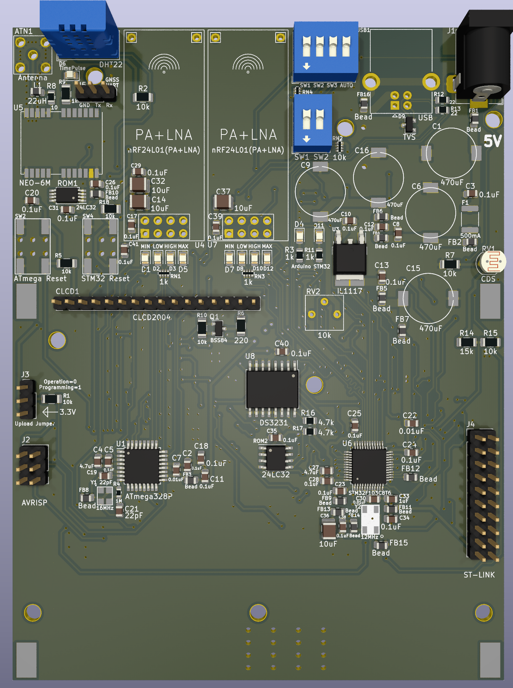
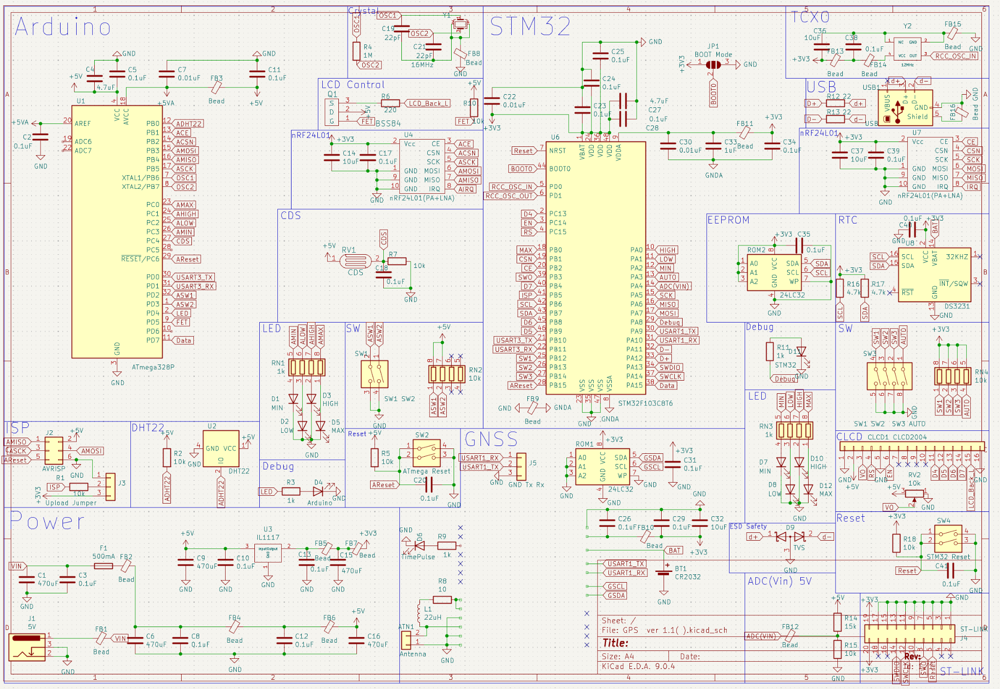
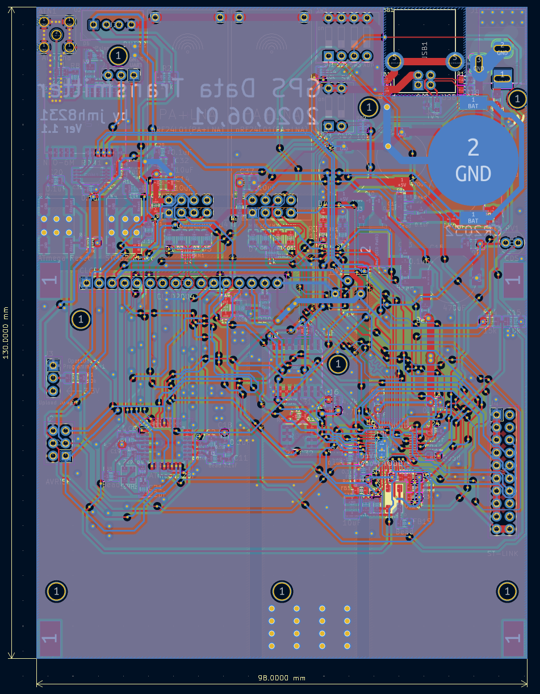
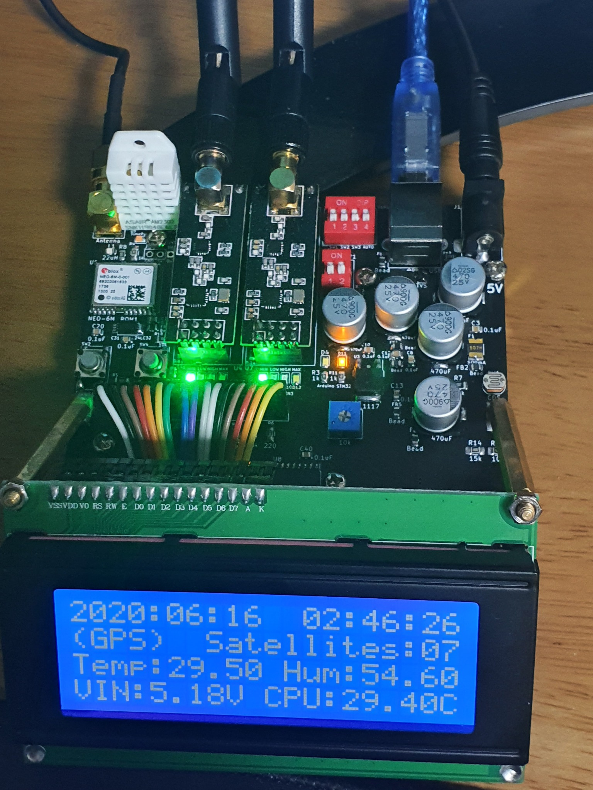

# GPS 데이터 송신기 (STM32F103 + ATmega328P)

두 개의 2.4 GHz RF 모듈(nRF24L01+ PA+LNA)과 GNSS, RTC, 환경 센서, 20×4 문자 LCD를 통합한 **원격 GPS 데이터 송신기**이다. 
보드는 **STM32F103C8T6**를 메인 MCU로, **ATmega328P**(Arduino 호환)를 서브 MCU로 사용한다. 서브 MCU는 센서 보조 처리 및
메인 MCU 상태 감시/리셋 보조를 담당한다. 펌웨어는 UBX 프로토콜로 GPS 시간을 수신하여 RTC(DS3231)를 보정하고,
RF/USB/UART로 상태를 송신한다.



---

## 1. 하드웨어 개요

- **MCU**
  - 메인: **STM32F103C8T6** (ST-LINK 20핀 헤더 제공)
  - 서브: **ATmega328P** (AVRISP 헤더, 16 MHz 크리스탈)
- **GNSS**
  - u‑blox **NEO-6M** 모듈(UBX 프로토콜), 백업 배터리(코인셀) 및 PPS/타임펄스 라우팅
- **무선(RF)**
  - **nRF24L01+ PA+LNA** 2개(각각 STM32/Arduino에 1개씩 연결), SMA 안테나
  - **DIP 스위치**로 송신 파워 레벨 설정(MIN/LOW/HIGH/MAX), **모두 OFF→MIN** 기본값
  - 파워 레벨 **LED 인디케이터** 제공
- **표시장치**
  - **20×4 캐릭터 LCD(CLCD2004)**, 백라이트 제어
- **센서**
  - **DHT22**(Temp/Hum) — 기본은 **ATmega328P**가 측정 → UART로 STM32에 전달
  - **CDS**(조도) — 야간에 LED OFF
- **시간/저장소**
  - **RTC: DS3231** (I²C), **EEPROM: 24LC32**
- **인터페이스/디버깅**
  - **USB‑to‑UART**(CDC 장치) 로그, **DFU**(USB) 업데이트
  - **ST‑LINK**, **AVRISP** 업로드 헤더, 수동/자동 리셋 회로

**참고 이미지**
- 스키매틱: `docs/images/schematic.png`
- PCB 레이아웃: `docs/images/pcb_layout.png`
- 동작 사진: `docs/images/photo_running.jpg`

---

## 2. 최종 동작 컨셉

1) **DIP 스위치로 RF 파워 레벨 제어**(STM32는 AUTO 모드 추가), **LED**로 단계 표시  
2) **USB‑to‑UART**로 디버깅/상태 표시(PC 미연결 시 LCD로 표시)  
3) **감시 구조**: STM32는 **IWDG**, ATmega328P는 **STM32에서 모니터링해 필요 시 리셋**  
4) **RTC 보정**: GPS 시간 수신 시 RTC 보정, GPS 부재 시 RTC 시간을 사용해 송신  
5) **2.4 GHz 간섭 방지**: **STM32 먼저 송신 → 신호 후 ATmega 송신**  
6) **DFU 업데이트**: SW 입력 조건에서 자동 리셋 + USB 활성화(펌웨어 업로드 편의성)

---

## 3. DIP 스위치/LED 정책

- **파워 레벨 매핑 (2비트 예시)**  
  `00 → MIN`, `01 → LOW`, `10 → HIGH`, `11 → MAX`  
  *모두 OFF일 경우 MIN로 동작.*
- **LED 표시**  
  레벨별 LED 켜짐(또는 LCD에 현재 단계 표시). 야간에는 **CDS** 감지로 LED OFF.

---

## 4. 펌웨어 구조(요약)

### 4.1 STM32 (핵심 루프)
- **GPS(UBX) 파싱** → **RTC(DS3231) 보정** → **LCD 표시(시각/출처/GPIO/전압·온도)** → **RF/USB 전송**
- **타이머(TIM2) 500 ms** 주기 이벤트로 LCD 갱신/주기 송신, **IWDG** 갱신
- **서브 MCU 감시**: UART로 수신된 헬스 바이트 점검, 이상 시 **ATmega328P 리셋 펄스**

주요 구현 포인트:
- UBX **NAV‑TIMEUTC** 메시지 파싱 및 체크섬 확인, GPS 유효 시각 판별(Valid bit)  
- GPS 유효 시 **RTC 보정**, 실패 시 **RTC 시각 사용**  
- LCD 4행 표시: 날짜·시간, 소스(GPS/RTC), 노드수(예약), 온습도(DHT22), VIN/MCU 온도  
- ATmega 리셋은 **최대 횟수 제한** 후 에러 플래그 표시

### 4.2 ATmega328P
- **DHT22 측정** → 결과 프레임을 **UART**로 STM32에 주기 전송  
- 특정 **PWM/헬스 신호 미수신** 시 STM32가 리셋(하드웨어 라인) 실행

---

## 5. 빌드/업로드

- **STM32**: STM32CubeIDE(HAL) 프로젝트. **ST‑LINK**로 프로그래밍. 필요 시 **DFU 모드** 진입 후 USB로 업데이트.
- **ATmega328P**: Arduino IDE 또는 AVR‑GCC. **AVRISP**(J2)로 업로드.
- 업로드 시 RF 모듈 탈착이 필요할 수 있으므로 점퍼를 통해 **Programming / Operation** 모드 선택.

---

## 6. 테스트 절차(예시)

1) USB 연결 후 CDC 시리얼 모니터로 로그 확인(보레이트 115200)  
2) GNSS 안테나 연결 → 위성 Lock 후 시간 동기화 확인  
3) DIP 스위치 단계 변경 → LED/LCD 표시 확인, RF 출력 단계 로깅  
4) DHT22 가열 시간 후 값 수신 → LCD 3행 온습도 표시 확인  
5) ISP 점퍼를 ‘Operation’으로 두고 재부팅 → 정상 동작 확인

---

## 7. 파일 트리 제안

```text
gps-tx/
├─ README.md
├─ firmware/
│  ├─ stm32/        # main.c, GPS.c, GPS_Data_Repeater.c 등
│  └─ atmega/       # ATmega328P.ino
└─ docs/
   ├─ images/       # schematic.png, pcb_layout.png, render_top.png, photo_running.jpg
   └─ media/        # demo.mp4 (선택)
```

---

## 8. 이미지





---

## 9. 라이선스

내부 프로젝트 정책에 따르며, 외부 라이브러리(예: STM32 HAL, u‑blox 프로토콜 참조)의 라이선스는 각 디렉터리에 명시한다.
